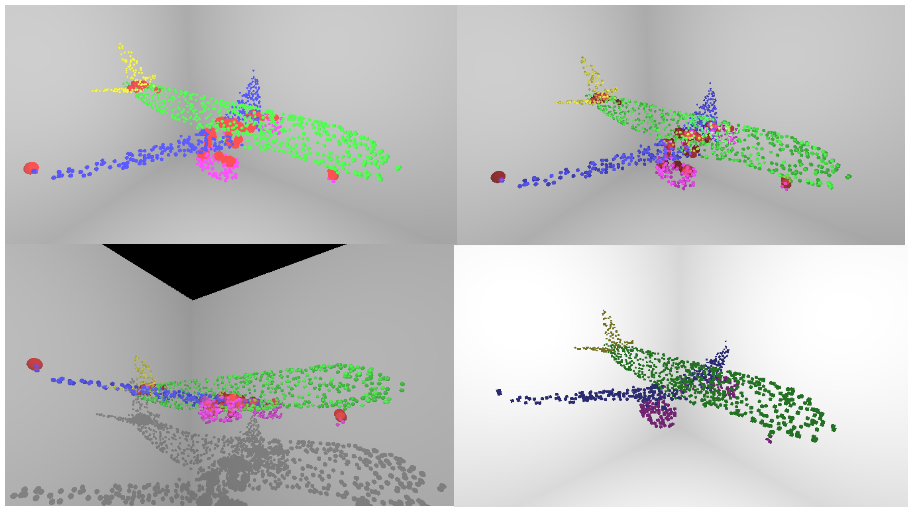
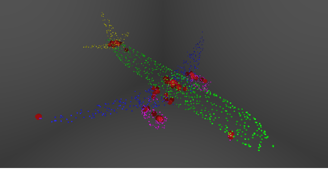
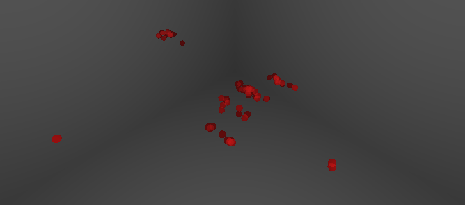
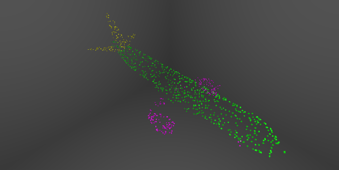
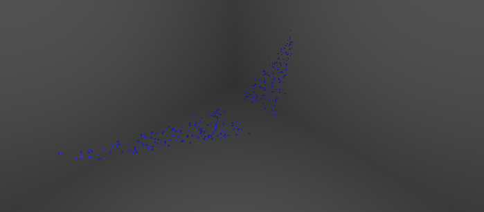
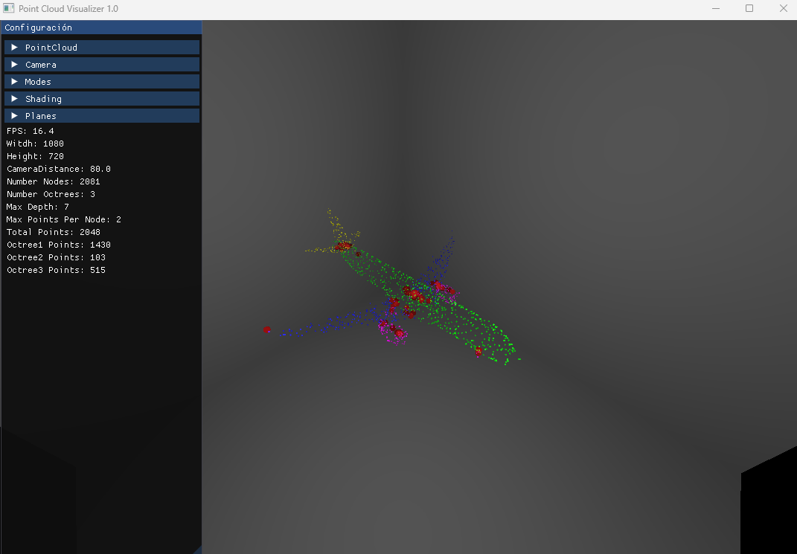

# Interactive-Multiple-Point-Cloud-Rendering-using-GPU-based-Raytracing ONLY PUBLIC ACCESS!!!!

## Table of Contents
- [Abstract](#abstract)
- [Gallery](#gallery)
- [Getting Started](#getting-started)
    - [Downloading the Repository](#downloading-the-repository)
    - [Running the Demo](#running-the-demo)
    - [Building and Running the Project](#building-and-running-the-project)
- [How to use](#how-to-use)

## Abstract
This thesis addresses the challenging task of visualizing 3D point cloud data in real time, specifically those derived from 3D object segmentation machine learning models. With the escalating demand for processing and visualizing substantial volumes of three-dimensional data, the use of technologies such as LIDAR scanners has become prevalent, leading to the generation of point clouds. Point clouds provide a detailed and accurate representation of the surfaces of 3D objects. Despite the complexity of 3D segmentation, which identifies the specific part of an object to which a point belongs, a unique real-time visualization tool utilizing ray tracing technology is proposed. This tool aims to highlight mistakes and compare models, improving our understanding and interpretation of model performance. A key innovation proposed in this project is the use of a multiOctree structure, which simplifies the visualization of the complex combinations of Octrees by separating different point clouds into different octrees for more efficient traversal and visualization, thereby improving the performance of the overall system.

## Gallery
1. Difference Alpha and Voxelization: 
   - 
     - This image represents a point cloud with octree and voxelization. It shows the shadowing and how the errors are visualized.
     
2. Multi Octree Visualization: 
   - 
     - This image showcases a multi octree visualization.
     
3. Multi Octree Segmentation:
   - These 3 images demonstrate how the multi octree can segmentate the visualization.
   
     

## Getting Started

### Downloading the Repository
Contact with me por more information.

### Running the Demo
1. Navigate to the `demo` directory in the cloned repository.
2. Choose either the `Debug` or `Release` directory based on your preference.
3. Execute the `script.exe` file. Either `Debug` or `Release` version should work. Depending on the performance of your computer, it should load in approximately 20 seconds.
4. Enjoy the experience!

### Building and Running the Project
If you wish to examine the code and run it, you would need to do so using Visual Studio:

1. Open Visual Studio.
2. Navigate to the `File` menu and select `Open`, then `Project/Solution`.
3. Navigate to the cloned repository directory and open the `TFG_GO.snl` solution file.
4. Once the solution is loaded, build and run the project as per usual in Visual Studio.

## How to use

### User Interface
- 
- Once the program has loaded, you should see a user interface (UI) with a configuration panel on the left and the point cloud visualizer in the center.

### Point Cloud Configuration
- Under the 'Configuración' header on the left side, you will see the 'PointCloud' section.
    - In this section, you can input a file URL or select a '.ply' file from your computer to load a point cloud.
    - Additionally, you can adjust various properties of the point cloud including the number of Octrees, maximum points, maximum depth, and more. Click 'Cargar' to load the point cloud with the selected settings, or 'Borrar' to remove the currently selected point cloud.
    - Use the point cloud selector to switch between loaded point clouds.

### Camera Configuration
- Under the 'Camera' header, you can switch between free mode and fixed mode, adjust the field of view (FoV), movement speed, and sensitivity. You can also adjust the position and orientation of the camera.

### Mode Selection
- Under the 'Modes' header, you can choose between different visualization modes including voxel and octree. There are various other options available depending on the selected mode, such as enabling or disabling Phong shading, segmented view, error display, shadow display, extra view, and ordered view.

### Shading Configuration
- Under the 'Shading' header, you can adjust various shading properties such as the radius, radius error, alpha ground, and alpha error. You can also add and delete point lights and adjust their properties.

### Plane Display Configuration
- Under the 'Planes' header, you can enable or disable the display of planes. You can adjust the scale factor of the planes and their material properties.

### Information Display
- At the bottom of the configuration panel, you can view various statistics such as frames per second (FPS), window dimensions, camera distance, the number of nodes, etc.

Remember to click 'Cargar' to load the point cloud with the current settings after making any changes in the configuration panel. Enjoy visualizing your point clouds!
